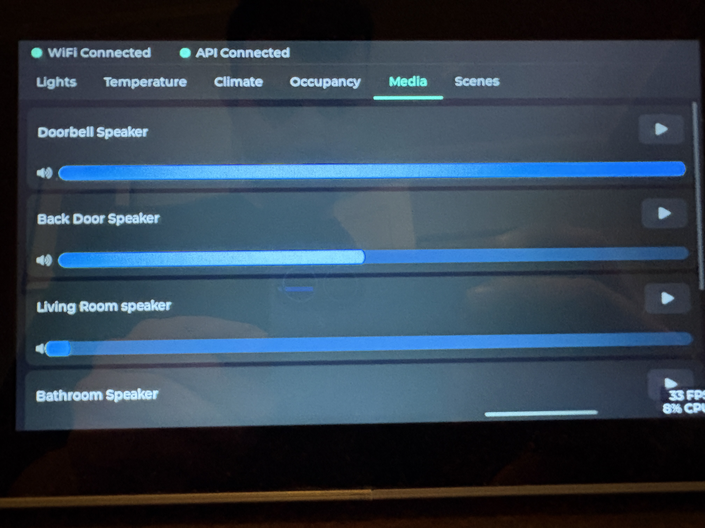
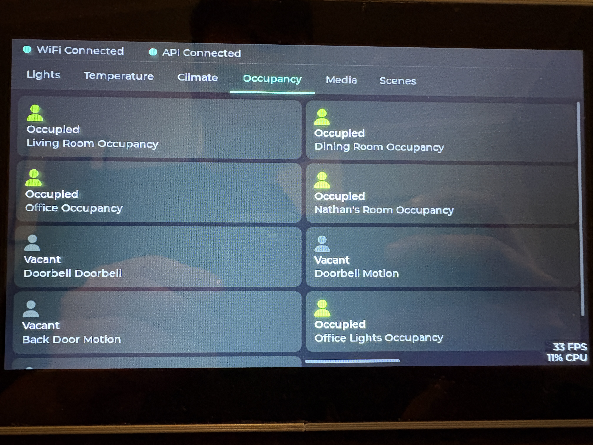
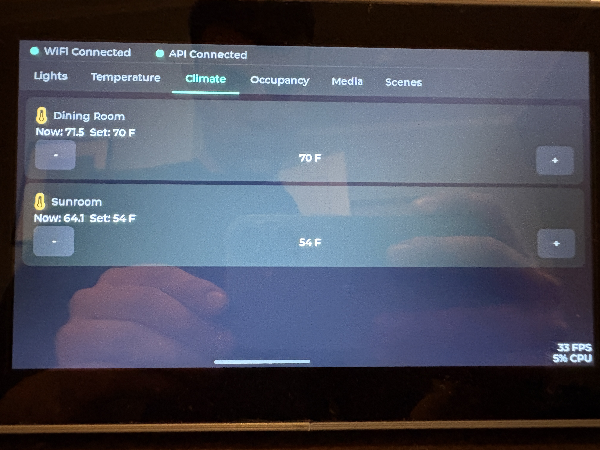
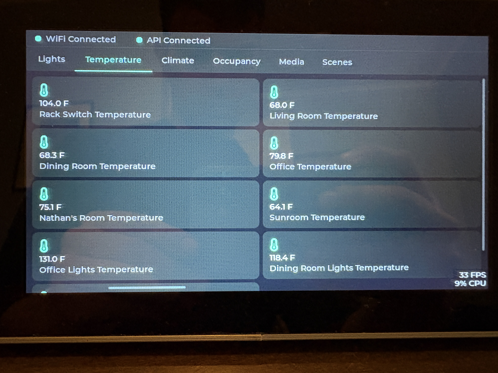
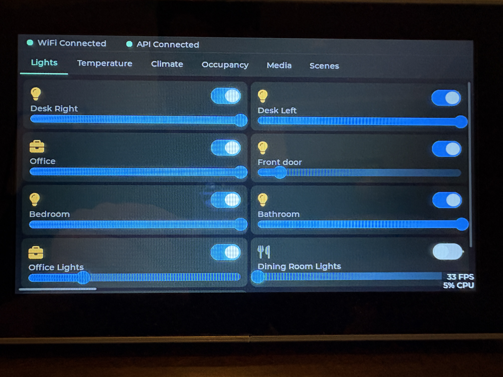

# HomePanel-S3: ESP32-S3 Home Assistant Touch Panel

HomePanel-S3 is a Wi-Fi-connected touch panel for Home Assistant, built on the ESP32-S3 platform. It features a 7" RGB LCD (ST7701, 800x480) and capacitive touch (GT911), providing a swipeable tabbed dashboard that automatically discovers and displays your smart home entities.


## Screenshots

| Lights | Temperature |
|--------|-------------|
|  |  |

| Climate | Occupancy |
|---------|-----------|
|  |  |

| Media |
|-------|
|  |

## Key Features

- **Auto-Discovery:** Fetches all entities from Home Assistant at boot, categorizes by domain (lights, temperature, climate, occupancy, media, scenes) — no manual entity configuration needed.
- **Swipeable Tabbed UI:** One full-screen page per category, navigable by swipe or tab tap. Only pages with at least one entity are shown.
- **Area Filter:** Optionally limit the panel to a single HA area (e.g. "Office") via `menuconfig`.
- **Entity Filters:** Hide specific entities by keyword via `menuconfig` — no code changes needed.
- **NVS Caching:** Discovered entities are cached so the UI loads instantly on reboot before HA responds.
- **Hardware-Accelerated Graphics:** Double/triple-buffered PSRAM rendering for tear-free 16-bit color.
- **Async Command Queue:** 120ms coalescing ensures the UI stays responsive during rapid interactions.
- **Robust Offline Handling:** Reconnection logic and "OFFLINE" badge after 3 consecutive API failures.

## Hardware

Built for the **[Waveshare ESP32-S3-Touch-LCD-7](https://www.waveshare.com/esp32-s3-touch-lcd-7.htm)** but adaptable to any ST7701-based RGB display.

| Component | Spec |
|-----------|------|
| MCU | ESP32-S3N16R8, dual-core Xtensa LX7, up to 240 MHz |
| Flash | 16 MB onboard |
| PSRAM | 8 MB octal |
| Display | 7" IPS, 800×480, 65K color, RGB parallel interface (ST7701) |
| Touch | GT911, 5-point capacitive, I2C |
| Wireless | 2.4 GHz Wi-Fi 802.11 b/g/n, Bluetooth 5 LE |
| USB | USB Type-C (full-speed) |
| Dimensions | 192.96 × 110.76 mm |

## Quick Start

### Prerequisites

- [ESP-IDF v5.5.0](https://docs.espressif.com/projects/esp-idf/en/v5.5/esp32s3/get-started/)
- Home Assistant with a Long-Lived Access Token

### 1. Clone and configure

```bash
git clone https://github.com/landaun/HomePanel-S3.git
cd HomePanel-S3
git submodule update --init --recursive

# Activate ESP-IDF (adjust path to your install)
. $IDF_PATH/export.sh   # Linux/macOS
# or: & $env:IDF_PATH\export.ps1   (Windows PowerShell)

idf.py menuconfig
```

In `menuconfig`, navigate to:

- **WiFi Configuration** — set your SSID and password
- **Home Assistant** — set your HA base URL (e.g. `http://homeassistant.local:8123`) and long-lived access token

### 2. Build and flash

```bash
idf.py build
idf.py -p <YOUR_COM_PORT> flash monitor
# e.g. COM3 on Windows, /dev/ttyUSB0 on Linux
# Exit monitor with Ctrl-]
```

### Alternative: environment variables (CLI builds)

Copy `scripts/set-env.ps1.template` to `scripts/set-env.ps1`, fill in your values, and run it before building:

```powershell
.\scripts\set-env.ps1
idf.py build
```

## Configuration Reference

All panel settings are in `idf.py menuconfig` → **Home Assistant** or **WiFi Configuration**.

| Setting | menuconfig path | Description |
|---------|----------------|-------------|
| WiFi SSID | WiFi Configuration | Network name |
| WiFi Password | WiFi Configuration | Network password |
| HA URL | Home Assistant | `http://your-ha-host:8123` |
| HA Token | Home Assistant | Long-lived access token |
| Area filter | Home Assistant | Restrict to one HA area (leave blank for all) |
| Hide numbered lights | Home Assistant | Strip "Light 1", "Light 2" sub-bulbs |
| Light keywords to hide | Home Assistant | Comma-separated name substrings to exclude from Lights page |
| Temperature keywords | Home Assistant | Comma-separated keywords to exclude from Temperature page |
| Occupancy keywords | Home Assistant | Comma-separated keywords to exclude from Occupancy page |

The `sdkconfig` file (which stores these values) is gitignored — credentials never leave your machine.

## How Auto-Discovery Works

On first boot (or when the entity list changes), the panel:

1. Connects to Wi-Fi and calls `/api/states` on your Home Assistant instance
2. Classifies each entity by domain: `light.*`, `climate.*`, `sensor.*` (temperature), `binary_sensor.*` (occupancy/motion), `media_player.*`, `scene.*`, `automation.*`
3. Optionally filters by HA area (if `CONFIG_HA_FILTER_AREA` is set)
4. Applies any keyword exclusion filters you configured
5. Builds one swipeable page per domain that has entities, then caches the result in NVS

On subsequent reboots the cached entity list is shown immediately, then refreshed in the background.

Entity states are polled from `/api/states` every 10 seconds.

### Scenes and Automations

Scenes and automations appear on the Scenes tab. Tap a button to activate a scene or trigger an automation. Disabled automations are hidden. Only the first 20 scenes and 20 automations are shown to avoid clutter.

### Color Temperature

Color temperature controls use mireds (`mireds = round(1e6 / kelvin)`), clamped to each light's `min_mireds`/`max_mireds`. RGB and color-temp sliders are only shown when the light's `supported_color_modes` includes `"rgb"` or `"color_temp"`. UI sliders debounce before sending to avoid flooding the network.

## Simulator (Windows)

Iterate on layout without flashing hardware. Requires **Visual Studio Build Tools** (MSVC) and CMake on PATH.

```bash
cmake -S simulator -B simulator/build
cmake --build simulator/build --config Release
.\simulator\build\Release\panel_simulator.exe
```

## Troubleshooting

**Panel won't connect to Home Assistant**
Verify `HA_BASE_URL` and `HA_TOKEN` in menuconfig match your server. An offline badge appears center-screen after 3 consecutive API failures (~30 seconds) and clears automatically on reconnect.

**Touch input unresponsive**
Confirm GT911 I2C wiring (SCL/SDA/RST) matches the pin assignments in `main/waveshare_rgb_lcd_port.h`. Default: SCL=GPIO9, SDA=GPIO8, RST=GPIO4.

**Watchdog resets**
Check `idf.py monitor` for `WDT timeout` messages. Ensure long operations yield or run in separate tasks.

**Memory pressure**
Run `idf.py size-components` or log `heap_caps_get_free_size(MALLOC_CAP_DEFAULT)` at runtime. Free unused LVGL objects promptly.

**Log level control**
Adjust in menuconfig (`Component config → Log output → Default log level`) or define `LOG_LOCAL_LEVEL` per file. Key log tags: `discovery`, `tabbed_ui`, `ha_client`, `CMDQ`, `wifi_mgr`.

## Reliability Checklist

Before deploying:

- [ ] Runs 24 hours without watchdog resets or memory leaks
- [ ] Offline badge appears after ~30s of HA unavailability and clears on reconnect
- [ ] All UI pages scroll and update correctly within ~10 seconds
- [ ] Touch accurate across the full display area
- [ ] Wi-Fi reconnects automatically after router restart

## License

MIT — see [LICENSE](LICENSE).

## Acknowledgments

- Display drivers based on Waveshare ESP32-S3-Touch-LCD-7 reference design
- UI powered by [LVGL](https://lvgl.io/) v8.3
